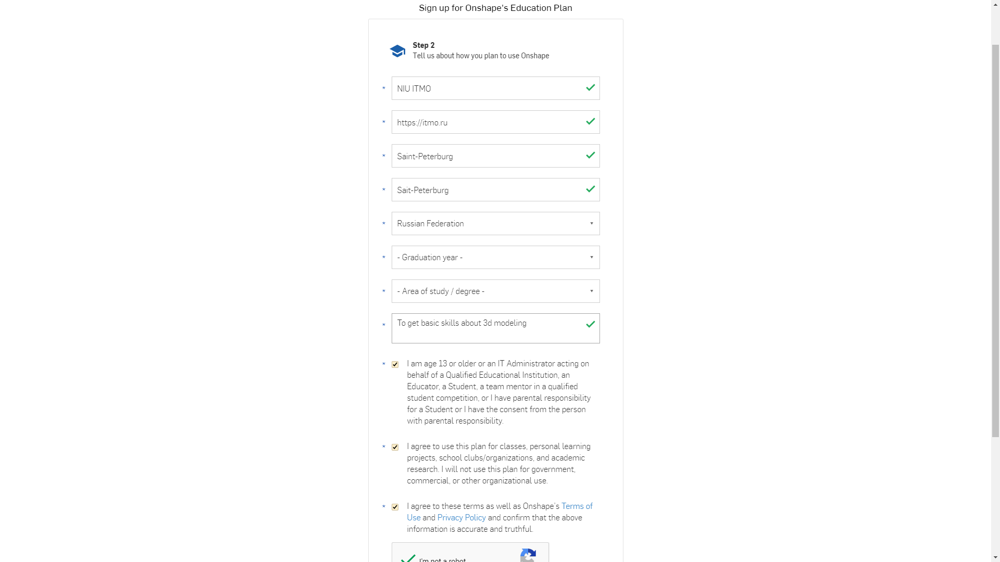

Подготовительный этап
=========================

На сегодняшний день существует большое множество программ для 3Д моделирования, выбор которых основан на ваших потребностях. 
Глобально 3Д моделирование можно разделить на 3 основных направления:

1. Скульптинг (в основном для создания сложных форм вроде лиц персонажей игр и анимаций);
2. Графическое (По большей части подобное моделирование широко используется при разработке игр, для создания окружения и предметов игрового мира);
3. Проектно инженерное проектирование в средах САПР (Системах Автоматизированного проектирования широко применяется во множестве отраслей, где необходимо проектирование и визуальное представление).

В рамках данного курса нас будет интересовать последний вариант. Программ САПР, позволяющих создавать сложные детали и механические конструкции, существует достаточно большое количество, но в их основе лежит один и тот же принцип - создание эскиза и дальнейшее его “выдавливание” или вращение. Так же некоторые программы позволяют различным образом проанализировать модель или сборку, что облегчает процесс производства конечной детали.

Эскиз - двумерный чертеж на плоскости. Пример эскиза можно увидеть на рисунке 1.

Выдавливание - Процесс превращения двумерного эскиза в 3-х мерный элемент путем выдавливания эскиза вдоль вектора, перпендикулярного плоскости эскиза, на заданную величину.

Вращение - Процесс превращения двумерного эскиза в 3-х мерный элемент путем вращения эскиза вокруг заданной оси, на угол от 0 до 360 градусов. На рисунке 2 б продемонстрировано вращение на 360 градусов.

       Рисунок 1 - Пример эскиза детали

.. figure:: _static/Pictures/lab0/Рисунок2.png
       :scale: 100 %
       :align: center
       :alt: Фигуры

       Рисунок 2 - а) Фигура, полученная из эскиза, изображенного на рисунке 1 путем “выдавливания”, б) Фигура, полученная из эскиза, изображенного на рисунке 1 путем его вращения вокруг своей оси

В этом курсе мы рассмотрим базовые возможности моделирования и конструирования сборок в облачном САПР “ONSHAPE”. Он интересен тем, что нет необходимости устанавливать большое количества программного обеспечения и иметь мощный компьютер или ноутбук, работать можно непосредственно в браузере, а также открывать, просматривать и отслеживать сделанные работы дистанционно. Также ключевой особенностью является то, что не нужно ничего сохранять, это делается автоматически в облаке буквально после каждого вашего действия.

Интересный факт, на данный момент в этом САПР работает компания “Моторика”, располагающаяся в “Сколково” и занимающаяся изготовлением и производством протезов.

Установка программы ONSHAPE

Для начала необходимо зарегистрироваться на сайте продукта. Для этого переходим по ссылке: https://www.onshape.com/signup.

.. figure:: _static/Pictures/lab0/Рисунок3.png
       :scale: 35 %
       :align: center
       :alt: Главная страница

       Рисунок 3 - Главная страница

На открывшейся странице выбираем “Education Account”

       Рисунок 4 - Education Account

Прокручиваем страницу ниже и заполняем регистрационное поле подобным образом, как показано на рисунке 5.

       Рисунок 5 - Пример заполнения анкеты

Соответственно заполняем 2 страницу. Затем нажимаем Create Account. Далее будет необходимо подтвердить свою почту и установить пароль. Перейдите по ссылке https://cad.onshape.com/signin и войдите в свой аккаунт.

Примечание

Выбирайте свой год окончания обучения и направление из списка, наиболее близкое к вашему.

Внешний вид программы ONSHAPE

После перехода по ссылке: https://cad.onshape.com/signin, в вашем браузере откроется окно, показанное на рисунке 6.

.. figure:: _static/Pictures/lab0/Рисунок6.png
       :scale: 35 %
       :align: center
       :alt: lab0

       Рисунок 6 

На открывшейся странице нажимаем “Create”. И далее создаем новый документ (Рисунок 7).

.. figure:: _static/Pictures/lab0/Рисунок7.png
       :scale: 35 %
       :align: center
       :alt: lab0

       Рисунок 7 

Создаем документ с именем “Caterpillar” и жмем “Create public document”.

Примечание

Так как  САПР является зарубежным продуктом,  в нем отсутствует русский язык, но можно использовать автопереводчик страницы. Хотя в этом нет острой необходимости, т. к. большая часть интерфейса ONSHAPE интуитивно понятна и имеет пиктограммы. В рамках данного курса будет использоваться оригинальная версия страницы.

В нижней части вашей веб-страницы присутствует две вкладки: Part Studio и Assembly (Рисунок 8).

       Рисунок 8 

Первая вкладка (Part Studio) используется для моделирования. Для удобства, несколько моделей одной группы следует делать в одной Part studio, но, когда там становится слишком много моделей, заниматься разработкой становится неудобно, следует разделять модели по группам. Вторая же вкладка отвечает за вашу сборку (объединение всех деталей в один механизм) со своими взаимосвязями и
степенями свободы. Но к ней мы вернемся позже, для начала назовем нашу вкладку “Body” (Рисунок 9).

.. figure:: _static/Pictures/lab0/Рисунок9.png
       :scale: 35 %
       :align: center
       :alt: lab0

       Рисунок 9 

Для моделирования будет использоваться европейский стандарт, а именно миллиметры (по умолчанию установлен американский стандарт - дюймы). Для смены единиц измерения нажимаем в правом верхнем углу на ваше имя и далее переходим в настройки профиля (Рисунок 10).

.. figure:: _static/Pictures/lab0/Рисунок10.png
       :scale: 35 %
       :align: center
       :alt: lab0

       Рисунок 10 

На открывшейся странице переходим в раздел “Preferences“ и устанавливаем настройки, как показано ниже:

1. Переходим в раздел Preferences;
2. В соответствующих полях задаем необходимые значения;
3. Сохраняем настройки;
4. Возвращаемся к нашему документу.

.. figure:: _static/Pictures/lab0/Рисунок11.png
       :scale: 35 %
       :align: center
       :alt: lab0

       Рисунок 11 
