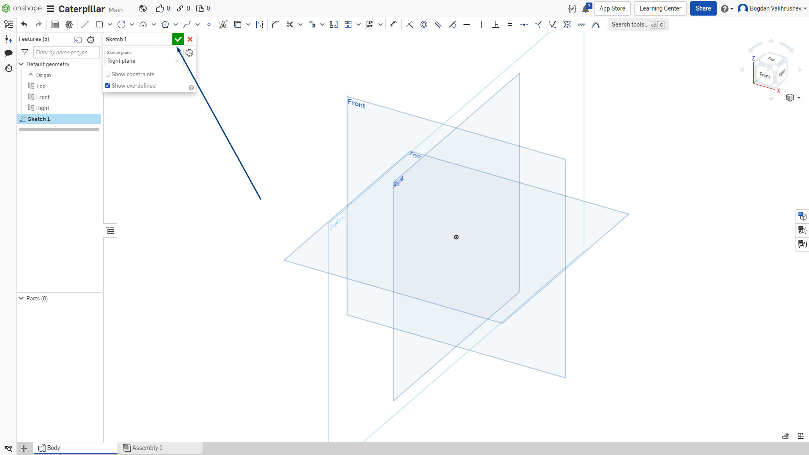
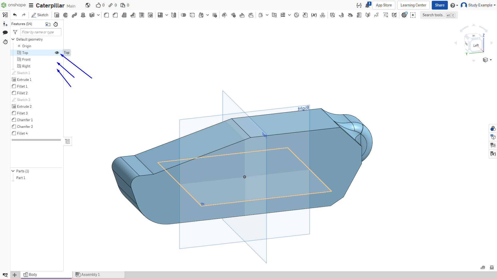

Лабораторная работа №1
=========================

Для создания первой детали необходимо сделать первый скетч. Скетч – это эскиз нашей детали. По факту, проекция нашей детали на одной из плоскостей. 

.. figure:: _static/Pictures/lab1/Рисунок1.png
       :scale: 35 %
       :align: center
       :alt: Плоскость для создания эскиза

       Рисунок 1 - Плоскость для создания эскиза

Выбираем плоскость, на которой будем делать эскиз. В данном случае выделяем правую плоскость «Right» и выбираем в панели инструментов «Sketch». Также эскиз можно создать, используя горячие клавиши «Shift+s»
Для того, чтобы подтвердить создание эскиза, необходимо нажать на символ «Подтвердить», как показано на рисунке 2.

       Рисунок 2 - Принятие создания эскиза

Управление интерфейсом. Данное управление относится к «Onshape (default)», как показано на рисунке 3. 

       Рисунок 3 - Настройка управления

1. Для приближения или отдаления используется вращение колесиком мыши;
2. Для перемещения камеры зажимаем колесико мыши и перемещаем мышь;
3. Для вращения зажимаем правую кнопку мыши и вращаем;
4. Также можно использовать куб в верхней правой части экрана, иллюстрация показана на рисунке 4;
5. Для перемещения между действиями можно использовать комбинации клавиш «Ctrl+z» и «Ctrl+y», как это сделано в программах Office. 

       Рисунок 4 - Управление через куб

Пока не будет закончена работа с эскизом не нажимаем на кнопку завершить создание эскиза (зеленая галочка), так как тогда не будет необходимости редактировать эскиз. Для этого необходимо будет заново выбрать данный эскиз в общем списке элементов.

Перейдем к первому эскизу, который мы создали ранее. Из инструментов на верхней панели выберем прямоугольник с центром в точке, как показано на рисунке 5. Размер прямоугольника будет 270 мм на 90 мм

       Рисунок 5 - Инструмент «Прямоугольник»

Далее нажимаем на центральную точку, как показано на рисунке 6-7, и, не удерживая никаких клавиш, перемещаем мышь в сторону, чтобы получился прямоугольник с примерно необходимыми размерами. Не старайтесь добиться точных геометрических размеров, дальше их можно будет скорректировать с использованием соответствующего инструмента.

       Рисунок 6 - Создание прямоугольника

       Рисунок 7 - Создание прямоугольника

Жмем ЛКМ чтобы подтвердить создание геометрического объекта на плоскости. Далее необходимо задать точные размеры нашего объекта:

1) Выбираем инструмент для проставления размеров, как показано на рисунке 8;
2) Нажимаем на отрезок для выставления размера.

.. figure:: _static/Pictures/lab1/Рисунок8.png
       :scale: 35 %
       :align: center
       :alt: Проставление размеров

       Рисунок 8 - Проставление размеров

Размер можно указывать для различных частей эскиза в зависимости от потребности: размер отрезка, расстояние между точками, угол между прямыми, радиус и диаметр. 

Отводим курсор на небольшое расстояние чтобы было удобнее вводить размер. Нажимаем ЛКМ и после вводим размер 90 мм. Подтверждаем нажатием на Enter. Аналогично задаем второй размер - 270 мм. Конечный результат показан на рисунке 9.

       Рисунок 9 - Определенная фигура

Далее проведем отрезок внутри нашего прямоугольника:

1) Выбираем инструмент для построения отрезков, как показано на рисунке 10.
2) Ставим точку, являющуюся началом построения отрезка;
3) Проводим отрезок во вторую точку.

       Рисунок 10 - Создание объекта «прямая»

После создания отрезка необходимо нажать кнопку “ESC”, чтобы закончить его создание. Далее выставляем размеры: угол и расстояние между точками как на рисунке 11.

.. figure:: _static/Pictures/lab1/Рисунок11.png
       :scale: 35 %
       :align: center
       :alt: Определение угла между двумя прямыми

       Рисунок 11 - Определение угла между двумя прямыми

Обратите внимание: геометрия, для которой указаны не все размеры подсвечивается синим, после того, как все размеры и зависимости указаны, геометрия приобретает черный цвет. Аналогично построим еще несколько отрезков, как показано на рисунке 12.

       Рисунок 12 - Добавление отрезков

Далее построим ломаную, состоящую из двух отрезков. Для первого отрезка необходимо соблюсти параллельность с верхней линией, строим его примерно параллельно, пока верхняя линия не подсветится, и не появится знак параллельности, как показано на рисунке 13. При построении эскизов следует учитывать порядок расположения элементов, так как последующее элементы могут зависеть от предыдущих.

       Рисунок 13 - Построение ломанной прямой

Подтверждаем наш скетч, кликнув на галочку в левой части экрана, как показано на рисунке 14. К данному скетчу можно будет всегда вернуться, нажав дважды по нему в дереве построения модели, рисунок 15.

.. figure:: _static/Pictures/lab1/Рисунок14.png
       :scale: 35 %
       :align: center
       :alt: Подтверждение скетча

       Рисунок 14 - Подтверждение скетча

       Рисунок 15 - Дерево модели

Далее нам необходимо создать объемный объект из созданного нами скетча:

1) Выбираем инструмент для выдавливания;     
2) Выбираем области, которые хотим выдавить.

Выбираем наш эскиз, но нам необходимо выбрать лишь внутреннюю часть. То, что не помечено оранжевым цветом на рисунке 16. Если выделилось что-то лишнее, достаточно просто нажать на ненужную часть эскиза ЛКМ.

       Рисунок 16 - Выдавливание эскиза

Глубину выдавливания можно изменять, перемещая белую стрелку с зажатой ЛКМ или, что точнее и, если вы знаете точный размер (рисунок 18), задать в выделенном поле. Вводим необходимое значение и нажимаем Enter. В нашем случае это 75 мм.

.. figure:: _static/Pictures/lab1/Рисунок17.png
       :scale: 35 %
       :align: center
       :alt: Пример выделение лишнего контура

       Рисунок 17 - Пример выделение лишнего контура

       Рисунок 18 - Стрелка регулирования глубины выдавливания и поле для ввода точного значения данного параметра

Теперь добавим скругления граней 3Д фигуры следующими инструментами, как показано на рисунке 19.

1) Сопряжение;
2) Фаска.

.. figure:: _static/Pictures/lab1/Рисунок19.png
       :scale: 35 %
       :align: center
       :alt: Выбор инструмента сопряжения

       Рисунок 19 - Выбор инструмента сопряжения

Выбираем сопряжение и нажимаем на нужное ребро:

1. Выбираем ребро;
2. Задаем величину.

Выставляем радиус сопряжение 40 мм и подтверждаем нажатием на зеленую галочку, как показано на рисунке 20. Если вы выделили неправильное ребро, просто нажмите по нему повторно для отмены. Чтобы выйти из режима фасок или закруглений, необходимо нажать ESC. Иллюстрация показана на рисунках 20-21.

       Рисунок 20 - Создание скругления

       Рисунок 21 - Создание скругления

Аналогично делаем сопряжение радиусом 10 мм для второго ребра, как показано на рисунке 22.

.. figure:: _static/Pictures/lab1/Рисунок22.png
       :scale: 35 %
       :align: center
       :alt: Создание сопряжения

       Рисунок 22 - Создание сопряжения

Теперь перейдем к задней части модели, где у нас будет в дальнейшем находиться втулка, которая будет вращать гусеницу. Создадим эскиз на плоскости, показанной на рисунке 23.

       Рисунок 23 - Плоскость для создания эскиза

Создаем окружность радиусом 50 мм, для выбора точки постарайтесь привязаться к центральной точке ребра, как показано на рисунке 24 – 25.

1) Выбираем инструмент для создания окружностей (необходимо построение окружности по двум точкам);
2) Выбираем точку в качестве центра окружности.

.. figure:: _static/Pictures/lab1/Рисунок24.png
       :scale: 35 %
       :align: center
       :alt: Создание окружности

       Рисунок 24 - Создание окружности

Чтобы задать размеры окружности необходимо дважды нажать на ее контур.

.. figure:: _static/Pictures/lab1/Рисунок25.png
       :scale: 35 %
       :align: center
       :alt: Создание окружности

       Рисунок 25 - Создание окружности

Если не получается привязать окружность к центральной точке, то постройте окружность в любом месте и привяжите ее к середине следующим образом:

1) Выбираем инструмент для привязки, рисунок 26;
2) Выбираем точку, которую нужно привязать (центр окружности);
3) Выбираем точку, к которой хотим привязать (середина отрезка).

Используя инструмент «Средняя точка» (midpoint), можно разделить отрезок на две равные части (рисунок 27), если это не происходит автоматически при наведении на отрезок.

       Рисунок 26 - Привязка окружности

.. figure:: _static/Pictures/lab1/Рисунок27.png
       :scale: 100 %
       :align: center
       :alt: Поиск середины отрезка

       Рисунок 27 - Поиск середины отрезка

Далее подтверждаем создание эскиза и переходим к его «выдавливанию». Если выдавливание происходит не в ту сторону, то для изменения направления необходимо поменять направление, как показано на рисунке 28.

.. figure:: _static/Pictures/lab1/Рисунок28.png
       :scale: 35 %
       :align: center
       :alt: Смена направления «выдавливания»

       Рисунок 28 - Смена направления «выдавливания»

Далее необходимо изменить модификатор выдавливания на «Add», как показано на рисунке 29. Это необходимо для того, чтобы не создавать новую деталь, что в дальнейшем упростит работу со сложными моделями. Выдавливаем на 45мм.

       Рисунок 29 - Выдавливание объекта модификатором "Add"

Добавим скругление радиусом 40мм, как показано на рисунке 30 и 31.

       Рисунок 30 - Добавление скругления радиусом 40 мм

.. figure:: _static/Pictures/lab1/Рисунок31.png
       :scale: 35 %
       :align: center
       :alt: Добавление скругления радиусом 40 мм

       Рисунок 31 - Добавление скругления радиусом 40 мм

Далее необходимо добавить фаску 10 мм по внешней грани модели, как это показано на рисунках 32 и 33. Для этого необходимо:

1) Выбираем инструмент для создания фасок;
2) Выбираем ребра для применения к ним инструмента;
3) Задаем расстояние фаски.

.. figure:: _static/Pictures/lab1/Рисунок32.png
       :scale: 35 %
       :align: center
       :alt: Создание фаски 10 мм

       Рисунок 32 - Создание фаски 10 мм

.. figure:: _static/Pictures/lab1/Рисунок33.png
       :scale: 35 %
       :align: center
       :alt: Создание фаски 10 мм

       Рисунок 33 - Создание фаски 10 мм

Добавим еще фаску величиной 10мм, как показано на рисунке 34.

.. figure:: _static/Pictures/lab1/Рисунок34.png
       :scale: 35 %
       :align: center
       :alt: Создание фаски 10 мм

       Рисунок 34 - Создание фаски 10 мм

Добавим скругление радиусом 9 мм на плоскости, показанной на рисунке 35.

.. figure:: _static/Pictures/lab1/Рисунок35.png
       :scale: 35 %
       :align: center
       :alt: Создание скругления 9 мм

       Рисунок 35 - Создание скругления 9 мм

Теперь необходимо сделать нашу деталь пустотелой. Для сложных форм существует инструмент «Shell». 

Примечание:
Чтобы стандартные плоскости не мешали моделированию можно отключить их видимость, как показано на рисунке 36.

       Рисунок 36 - Отключение видимости стандартных плоскостей

Итак, для создания корпусной детали необходимо воспользоваться инструментом «Shell»:

1) Активируем инструмент;
2) Выбираем грань для удаления и создания полости;
3) Выставляем необходимую толщину стенки 4 мм.

Получаем пустотелую деталь (рисунок 37-38).

       Рисунок 37 - Создание пустотелой детали

.. figure:: _static/Pictures/lab1/Рисунок38.png
       :scale: 35 %
       :align: center
       :alt: Создание пустотелой детали

       Рисунок 38 - Создание пустотелой детали

Далее необходимо будет разделить нашу деталь на три составляющие, чтобы с ними было удобнее работать во время изготовления на 3Д принтере. Для того, чтобы разрезать объект, предусмотрен специальный инструмент, но нам требуется не просто разрезать, а еще добавить небольшой зазор между деталями, так как во время печати происходит расширение пластика, и размеры получаются немного больше тех, которые мы задаем в среде моделирования. Данный зазор для каждого принтера и пластика индивидуальны, но наиболее универсальные:

1) Для тугой посадки металл-пластик 0.15 мм с каждой стороны;
2) Для свободной посадки металл-пластик или для подвижного соединения на трении 0.2~0.25 мм;
3) Для тугой посадки пластик-пластик 0.2 мм;
4) Для подвижного соединения вращения 0.25 мм;
5) Для подвижного соединения скольжения 0.3~3.5 мм.

Первым дело нам необходимо разрезать деталь, как показано на рисунке 39.

.. figure:: _static/Pictures/lab1/Рисунок39.png
       :scale: 150 %
       :align: center
       :alt: Шаблон для резки детали

       Рисунок 39 - Шаблон для резки детали

Для этого создаем эскиз на верхней плоскости детали, как показано на рисунке 40.

.. figure:: _static/Pictures/lab1/Рисунок40.png
       :scale: 35 %
       :align: center
       :alt: Создание плоскости

       Рисунок 40 - Создание плоскости

Не все части детали находятся на одном уровне с плоскостью, на которой мы начали делать эскиз, это можно увидеть на рисунке 41. Для этого можно спроецировать данные части на нашу плоскость, применив инструмент «Project», как показано на рисунке 42. То есть необходимо выбрать инструмент «Project» и последовательно спроецировать грани объекта.

       Рисунок 41 - Разные плоскости

.. figure:: _static/Pictures/lab1/Рисунок42.png
       :scale: 100 %
       :align: center
       :alt: Проецирование граней на плоскость эскиза

       Рисунок 42 - Проецирование граней на плоскость эскиза

Таким образом были спроецированы грани объекта на плоскость, результат представлен на рисунке 43.

       Рисунок 43 - Результат проецирования

Далее необходимо на расстоянии 4 мм от спроецированной прямой провести параллельную прямую, как показано на рисунке 44.

.. figure:: _static/Pictures/lab1/Рисунок44.png
       :scale: 35 %
       :align: center
       :alt: Создание прямой

       Рисунок 44 - Создание прямой

Далее воспользуемся инструментов «Offset» (рисунок 45), чтобы провести такую же прямую на расстоянии 0.1 мм от первой, как показано на рисунке 46.

       Рисунок 45 - Инструмент «Offset»

.. figure:: _static/Pictures/lab1/Рисунок46.png
       :scale: 100 %
       :align: center
       :alt: Создание прямой

       
.. figure:: _static/Pictures/lab1/Рисунок46др1.png
       :scale: 100 %
       :align: center
       :alt: Создание прямой

       
.. figure:: _static/Pictures/lab1/Рисунок46др2.png
       :scale: 100 %
       :align: center
       :alt: Создание прямой

       Рисунок 46 - Последовательность построения объекта на плоскости, по которому будет происходить разрез

.. figure:: _static/Pictures/lab1/Рисунок47.png
       :scale: 35 %
       :align: center
       :alt: Лаб1

       Рисунок 47

Зазор 0.1, так как деталь изготавливается из нескольких частей, и на границе некоторых соединений не делается зазор, и тем самым опять же, из-за особенностей печати, недостающий зазор компенсируется там.

Добавим еще один элемент на эскиз.

.. figure:: _static/Pictures/lab1/Рисунок48.png
       :scale: 35 %
       :align: center
       :alt: Лаб1

       Рисунок 48 

Добавим еще один элемент на эскиз.

       Рисунок 49 

Далее выдавливаем наш эскиз.

       Рисунок 50 

Для определения глубины выдавливания.

.. figure:: _static/Pictures/lab1/Рисунок51.png
       :scale: 35 %
       :align: center
       :alt: Лаб1

       Рисунок 51 

И выбираем плоскость, до которой необходимо выдавить.

.. figure:: _static/Pictures/lab1/Рисунок52.png
       :scale: 35 %
       :align: center
       :alt: Лаб1

       Рисунок 52 

Теперь второй разрез. Для эскиза выбираем показанную плоскость.

.. figure:: _static/Pictures/lab1/Рисунок53.png
       :scale: 35 %
       :align: center
       :alt: Лаб1

       Рисунок 53 

Здесь в качестве эскиза простой прямоугольник (не с центров в середине).

       Рисунок 54 

Обратите внимание! Верхняя сторона прямоугольника лежит на границе плоскости до которой мы производили выдавливание.

.. figure:: _static/Pictures/lab1/Рисунок55.png
       :scale: 35 %
       :align: center
       :alt: Лаб1

       Рисунок 55 

Выдавливаем весь прямоугольник на 71 мм с модификатором “Remove”.

.. figure:: _static/Pictures/lab1/Рисунок56.png
       :scale: 35 %
       :align: center
       :alt: Лаб1

       Рисунок 56 

Наша деталь разбилась на 3 отдельных. Аналогично с плоскостями мы можем делать невидимыми отдельные детали.

       Рисунок 57 
