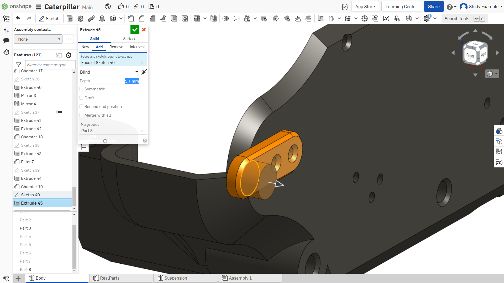
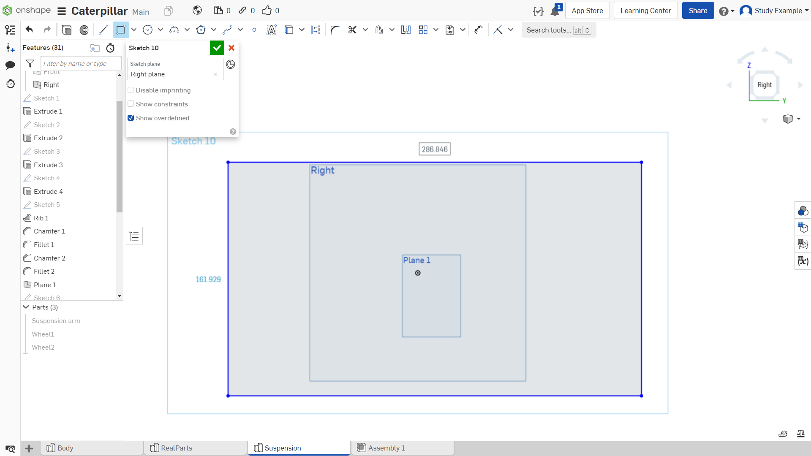

Лабораторная работа №12
=========================

Создание сборки

Для начала необходимо перейти в раздел сборки – «Assembly». Если у вас он отсутствует, то добавьте его, нажав на «+», как показано на рисунке 1.

.. figure:: _static/Pictures/lab12/Рисунок1.png
       :scale: 100 %
       :align: center
       :alt: Раздел «Assembly»

       Рисунок 1 - Раздел «Assembly»

Далее необходимо добавить элементы в сборку, как показано на рисунках 2-3. Для этого:

1) Нажимаем на «Insert»;
2) Разворачиваем список деталей «Body»;
3) Выбираем необходимые нам детали. В данном случае выберем первые три. Переместите курсор мыши на поле сборки и нажмите ЛКМ. Для подтверждения вставки нажмите на зеленую галочку.

.. figure:: _static/Pictures/lab12/Рисунок2.png
       :scale: 35 %
       :align: center
       :alt: Добавление деталей в сборку

       Рисунок 2 - Добавление деталей в сборку

       Рисунок 3 - Добавление деталей в сборку

Теперь закрепим большую черную деталь «Part3». В панели вставленных деталей нажимаем ПКМ на деталь 3 и нажимаем на «FIX». Это зафиксирует данную деталь. Это делается для того, чтобы в дальнейшем «привязывать» с помощью зависимостей к ней другие детали.

Иллюстрация на рисунке 4.

Зависимости — это связи между деталями, определяющие степени их свободы. Они необходимы для создания сборки с различными степенями свободы.

.. figure:: _static/Pictures/lab12/Рисунок4.png
       :scale: 35 %
       :align: center
       :alt: Фиксирование элемента

       Рисунок 4 - Фиксирование элемента

Можете попробовать «подвигать» детали с зажатой на них ЛКМ. Если же просто нажать по детали, появятся элементы для более точного перемещения и поворотов:

1) Движение вдоль одной оси;
2) Поворот детали на определенный угол;
3) Перемещение детали в одной плоскости.

Иллюстрация на рисунках 5–6.

.. figure:: _static/Pictures/lab12/Рисунок5.png
       :scale: 35 %
       :align: center
       :alt: Перемещение детали

       Рисунок 5 - Перемещение детали

.. figure:: _static/Pictures/lab12/Рисунок6.png
       :scale: 35 %
       :align: center
       :alt: Перемещение детали

       Рисунок 6 - Перемещение детали

Далее необходимо закрепить детали относительно друг друга. Для этого в верхней панели есть множество инструментов, позволяющих делать привязки с различной степенью свободы. Для создания первых зависимостей выберем инструмент «Planar mate», он создает зависимость между плоскостями разных объектов:

1) Выберем инструмент “Planar mate”;
2) Выберем плоскость как показано на рисунке 7.

.. figure:: _static/Pictures/lab12/Рисунок7.png
       :scale: 35 %
       :align: center
       :alt: Инструмент «Planar mate»

       Рисунок 7 - Инструмент «Planar mate»

Обратите внимание на то, чтобы плоскость подсвечивалась точно так же, как на рисунке 8.

.. figure:: _static/Pictures/lab12/Рисунок8.png
       :scale: 35 %
       :align: center
       :alt: Проверка

       Рисунок 8 - Проверка

Теперь аналогично выберем плоскость на черной детали, как показано на рисунке 9.

       Рисунок 9 - Выбор плоскости

Как можно вспомнить, при разрезании детали мы оставляли зазор 0.2 мм, нам нужно соблюсти его в сборке:

1) Активируем «Offset»;
2) Задаем расстояние «-0.2». Наши плоскости как раз будут на расстоянии 0.2 мм друг от друга.

Аналогично создадим следующую зависимость между следующими плоскостями, как показано на рисунках 10–11. Не забываем про зазоры.

.. figure:: _static/Pictures/lab12/Рисунок10.png
       :scale: 35 %
       :align: center
       :alt: Плоскости, между которыми создаем зависимости

       Рисунок 10 - Плоскости, между которыми создаем зависимости

.. figure:: _static/Pictures/lab12/Рисунок11.png
       :scale: 95 %
       :align: center
       :alt: Плоскости, между которыми создаем зависимости

       Рисунок 11 - Плоскости, между которыми создаем зависимости

Создаем третью зависимость для нашей пары деталей. Выделяем 2 плоскости, как показано на рисунках 12–13, но здесь не нужно задавать зазор, т. к. выделенные стороны компланарны (т. е. находятся в одной плоскости).

.. figure:: _static/Pictures/lab12/Рисунок12.png
       :scale: 35 %
       :align: center
       :alt: Плоскости, между которыми создаем зависимости

       Рисунок 12 - Плоскости, между которыми создаем зависимости

.. figure:: _static/Pictures/lab12/Рисунок13.png
       :scale: 95 %
       :align: center
       :alt: Плоскости, между которыми создаем зависимости

       Рисунок 13 - Плоскости, между которыми создаем зависимости

После выделения детали могут съехать, не переживайте, просто подтверждаем создание зависимости. Готово, теперь две детали взаимосвязаны (рисунок 14).

.. figure:: _static/Pictures/lab12/Рисунок14.png
       :scale: 35 %
       :align: center
       :alt: Две взаимосвязанные детали

       Рисунок 14 - Две взаимосвязанные детали

Аналогично создайте зависимости между плоскостями как показано на рисунке 15. Зазор 0.2 мм.

.. figure:: _static/Pictures/lab12/Рисунок15.png
       :scale: 35 %
       :align: center
       :alt: Плоскости, между которыми создаем зависимости

       Рисунок 15 - Плоскости, между которыми создаем зависимости

       Рисунок 16 - Плоскости, между которыми создаем зависимости

Итого, следующая деталь должна жестко закрепиться в положении, как показано на рисунке 17. Обратите Внимание: сейчас должно быть 6 взаимосвязей, если их меньше, значит у какой-то детали останется степень свободы по одному из направлений.

.. figure:: _static/Pictures/lab12/Рисунок17.png
       :scale: 35 %
       :align: center
       :alt: Результат создания зависимостей

       Рисунок 17 - Результат создания зависимостей

Далее добавим в сборку шаговый двигатель, как показано на рисунке 18.

.. figure:: _static/Pictures/lab12/Рисунок18.png
       :scale: 35 %
       :align: center
       :alt: Добавление шагового двигателя

       Рисунок 18 - Добавление шагового двигателя

Теперь добавим зависимость «Revolute mate»:

1) Выбираем создание нужной зависимости;
2) Выделяем окружность как показано на рисунке 19.

.. figure:: _static/Pictures/lab12/Рисунок19.png
       :scale: 35 %
       :align: center
       :alt: Выделяемая окружность

       Рисунок 19 - Выделяемая окружность

.. figure:: _static/Pictures/lab12/Рисунок20.png
       :scale: 35 %
       :align: center
       :alt: Лаб12

       Рисунок 20 

И выбираем вторую окружность на черной корпусной детали (эта зависимость позволяет создать связь между круглыми объектами, позволяя создать вращательную степень свободы).

       Рисунок 21 

После деталь может повернуть в противоположную сторону от того как нужно.

1-Нажимаем на стрелочку, для того чтобы изменилась ориентация детали на 180 градусов;
2-Подтверждаем создание зависимости.

.. figure:: _static/Pictures/lab12/Рисунок22.png
       :scale: 35 %
       :align: center
       :alt: Лаб12

       Рисунок 22 

Теперь установим шаговый двигатель в необходимом положении с помощью зависимости “Parallel mate”

1.Выбираем инструмент;
2.Выбираем плоскость двигателя;
3.Выбираем ребро второй детали.

Подтверждаем создание зависимости.

.. figure:: _static/Pictures/lab12/Рисунок23.png
       :scale: 35 %
       :align: center
       :alt: Лаб12

       Рисунок 23 

Теперь необходимо создать крепежные отверстия для двигателя. В onshape можно редактировать детали, вставленные в сборку с видимостью других элементов этой сборки.
Для этого дважды нажмите ЛКМ по детали (Part 3).

.. figure:: _static/Pictures/lab12/Рисунок24.png
       :scale: 35 %
       :align: center
       :alt: Лаб12

       Рисунок 24

При таком переходе к детали сверху появляется окно

1. При нажатии на крестик из видимости пhопадут все детали? не находящиеся в данном разделе с деталями.
2. При нажатии “Go to assembly” вы вернетесь к сборке.

.. figure:: _static/Pictures/lab12/Рисунок25.png
       :scale: 35 %
       :align: center
       :alt: Лаб12

       Рисунок 25

.. figure:: _static/Pictures/lab12/Рисунок26.png
       :scale: 35 %
       :align: center
       :alt: Лаб12

       Рисунок 26

Создаем эскиз и проецируем отверстия шагового двигателя на него.

       Рисунок 27

В итоге должен получиться такой эскиз, как на рисунке 28 (необходимо построить окружности со смещением 2мм).

       Рисунок 28

Выдавливаем на 10мм, как показано на рисунке 29.

       Рисунок 29

Из того же эскиза выдавливаем внутренние сквозные отверстия, так же на 10мм (рисунок 30).

       Рисунок 30

И добавляем фаски 1мм.

.. figure:: _static/Pictures/lab12/Рисунок31.png
       :scale: 35 %
       :align: center
       :alt: Лаб12

       Рисунок 31 - Добавление фасок

Вернемся в сборку и вставим в нее 3 детали “Bushing”, как показано на рисунке 32.

       Рисунок 32

Теперь необходимо зафиксировать эти элементы.

Выбираем создание зависимости “Revolute mate” и создаем зависимость между показанными окружностями деталей (Рисунок 33).

.. figure:: _static/Pictures/lab12/Рисунок33.png
       :scale: 35 %
       :align: center
       :alt: Лаб12

       Рисунок 33

Чтобы серая деталь не вращалась, устанавливаем ограничение, нажимаем в пункте “Limits” и выставляем 0 градусов, как показано на рисунке 34.

       Рисунок 34

Аналогичным образом зафиксируем 2 оставшиеся детали. Итого добавляется 3 новых зависимости.

Теперь добавим в сборку детали для стягивания нижних половинок корпуса в количестве 4х штук (рисунок 35).

       Рисунок 35

Задаем зависимость для одной детали как показано на рисунках 36-38.

.. figure:: _static/Pictures/lab12/Рисунок36.png
       :scale: 35 %
       :align: center
       :alt: Лаб12

       Рисунок 36

.. figure:: _static/Pictures/lab12/Рисунок37.png
       :scale: 35 %
       :align: center
       :alt: Лаб12

       Рисунок 37

       Рисунок 38

Деталь зафиксирована, аналогично фиксируем остальные детали.

       Рисунок 39

В итоге должно получиться так, как показано на рисунке 40.

       Рисунок 40

Следующим шагом добавим в сборку колесо с рычагом подвески.

.. figure:: _static/Pictures/lab12/Рисунок41.png
       :scale: 35 %
       :align: center
       :alt: Лаб12

       Рисунок 41

.. figure:: _static/Pictures/lab12/Рисунок42.png
       :scale: 35 %
       :align: center
       :alt: Лаб12

       Рисунок 42

       Рисунок 43

       Рисунок 44

.. figure:: _static/Pictures/lab12/Рисунок45.png
       :scale: 35 %
       :align: center
       :alt: Лаб12

       Рисунок 45

.. figure:: _static/Pictures/lab12/Рисунок46.png
       :scale: 35 %
       :align: center
       :alt: Лаб12

       Рисунок 46

.. figure:: _static/Pictures/lab12/Рисунок47.png
       :scale: 35 %
       :align: center
       :alt: Лаб12

       Рисунок 47

Задаем все необходимые взаимосвязи, чтобы закрепить первый рычаг подвески (рисунок 48).

.. figure:: _static/Pictures/lab12/Рисунок48.png
       :scale: 35 %
       :align: center
       :alt: Лаб12

       Рисунок 48

Далее необходимо установить еще 2 аналогичных объекта, для упрощения воспользуйтесь следующей функцией: сначала выделите 3 детали как показано на рисунке 48.

       Рисунок 49

.. figure:: _static/Pictures/lab12/Рисунок50.png
       :scale: 35 %
       :align: center
       :alt: Лаб12

       Рисунок 50

.. figure:: _static/Pictures/lab12/Рисунок51.png
       :scale: 35 %
       :align: center
       :alt: Лаб12

       Рисунок 51

Таким образом мы добавили 3 составных элемента в сборку максимально просто.

.. figure:: _static/Pictures/lab12/Рисунок52.png
       :scale: 35 %
       :align: center
       :alt: Лаб12

       Рисунок 52

       Рисунок 53

Устанавливаем еще один элемент.

       Рисунок 54

Вернемся к моделированию, далее, следуя картинкам, создайте новую деталь (рисунки 55-64).

.. figure:: _static/Pictures/lab12/Рисунок55.png
       :scale: 35 %
       :align: center
       :alt: Лаб12

       Рисунок 55

       Рисунок 56

       Рисунок 57

       Рисунок 58

.. figure:: _static/Pictures/lab12/Рисунок59.png
       :scale: 35 %
       :align: center
       :alt: Лаб12

       Рисунок 59

       Рисунок 60

.. figure:: _static/Pictures/lab12/Рисунок61.png
       :scale: 35 %
       :align: center
       :alt: Лаб12

       Рисунок 61

.. figure:: _static/Pictures/lab12/Рисунок62.png
       :scale: 35 %
       :align: center
       :alt: Лаб12

       Рисунок 62

       Рисунок 63

       Рисунок 64

Вернемся к редактированию сборки, добавим только что созданный элемент.

.. figure:: _static/Pictures/lab12/Рисунок65.png
       :scale: 35 %
       :align: center
       :alt: Лаб12

       Рисунок 65

Добавим ведущее колесо вместе с муфтой (Рисунок 66).

.. figure:: _static/Pictures/lab12/Рисунок66.png
       :scale: 35 %
       :align: center
       :alt: Лаб12

       Рисунок 66

       Рисунок 67

Добавляем еще 1 колесо (рисунки 68, 69).

       Рисунок 68

.. figure:: _static/Pictures/lab12/Рисунок69.png
       :scale: 35 %
       :align: center
       :alt: Лаб12

       Рисунок 69

Для того чтобы сделать гусеницу которая будет “облегать” все колеса нужен эскиз по которому “лягут” траки (рисунок 70). Переходим в раздел “Suspension”, создаем эскиз на базовой плоскости как показано на рисунке. Создайте случайный вспомогательный прямоугольник примерно схожих размеров.

       Рисунок 70

Нужно вставить эскиз ранее нарисованного прямоугольника в сборку, для этого нужно активировать такую возможность нажатием на иконку показанную на рисунке 71.

.. figure:: _static/Pictures/lab12/Рисунок71.png
       :scale: 35 %
       :align: center
       :alt: Лаб12

       Рисунок 71

       Рисунок 72

Позиционируем таким образом чтобы он находился между колесами и плоскостью корпуса.

Переходим в редактирование эскиза из сборки и с помощью проектирования строим такой эскиз (рисунок 73, 74).

.. figure:: _static/Pictures/lab12/Рисунок73.png
       :scale: 35 %
       :align: center
       :alt: Лаб12

       Рисунок 73

       Рисунок 74

Создаем эскиз на базовой плоскости (рисунки 75-86).

       Рисунок 75

.. figure:: _static/Pictures/lab12/Рисунок76.png
       :scale: 35 %
       :align: center
       :alt: Лаб12

       Рисунок 76

       Рисунок 77

.. figure:: _static/Pictures/lab12/Рисунок78.png
       :scale: 35 %
       :align: center
       :alt: Лаб12

       Рисунок 78

.. figure:: _static/Pictures/lab12/Рисунок79.png
       :scale: 35 %
       :align: center
       :alt: Лаб12

       Рисунок 79

       Рисунок 80

       Рисунок 81

.. figure:: _static/Pictures/lab12/Рисунок82.png
       :scale: 35 %
       :align: center
       :alt: Лаб12

       Рисунок 82

       Рисунок 83

       Рисунок 84

.. figure:: _static/Pictures/lab12/Рисунок85.png
       :scale: 35 %
       :align: center
       :alt: Лаб12

       Рисунок 85

       Рисунок 86

Вернемся к эскизу на рисунке 84, его необходимо немного сдвинуть так, чтобы нижняя горизонтальная линия проходила через центральную точку.

.. figure:: _static/Pictures/lab12/Рисунок87.png
       :scale: 35 %
       :align: center
       :alt: Лаб12

       Рисунок 87

.. figure:: _static/Pictures/lab12/Рисунок88.png
       :scale: 35 %
       :align: center
       :alt: Лаб12

       Рисунок 88

С помощью инструмента смещения создаем внутренний эскиз со смещением 0.5 мм (рисунки 89-91).

.. figure:: _static/Pictures/lab12/Рисунок89.png
       :scale: 35 %
       :align: center
       :alt: Лаб12

       Рисунок 89

.. figure:: _static/Pictures/lab12/Рисунок90.png
       :scale: 35 %
       :align: center
       :alt: Лаб12

       Рисунок 90

.. figure:: _static/Pictures/lab12/Рисунок91.png
       :scale: 35 %
       :align: center
       :alt: Лаб12

       Рисунок 91

Далее, чтобы получить гусеницу, используем создание массива по линии.
Не забываем переключить в режим добавления элементов для того, чтобы уменьшить количество деталей и упростить дальнейшую работу. Вставляем гусеницу в сборку (рисунки 92-95).

.. figure:: _static/Pictures/lab12/Рисунок92.png
       :scale: 35 %
       :align: center
       :alt: Лаб12

       Рисунок 92

       Рисунок 93

.. figure:: _static/Pictures/lab12/Рисунок94.png
       :scale: 35 %
       :align: center
       :alt: Лаб12

       Рисунок 94

.. figure:: _static/Pictures/lab12/Рисунок95.png
       :scale: 35 %
       :align: center
       :alt: Лаб12

       Рисунок 95

Далее на основе полученных навыков достройте модель до целой. Ниже представлены изображения того, что должно получиться в итоге (рисунки 96-103).

.. figure:: _static/Pictures/lab12/Рисунок96.png
       :scale: 35 %
       :align: center
       :alt: Лаб12

       Рисунок 96

.. figure:: _static/Pictures/lab12/Рисунок97.png
       :scale: 35 %
       :align: center
       :alt: Лаб12

       Рисунок 97

.. figure:: _static/Pictures/lab12/Рисунок98.png
       :scale: 35 %
       :align: center
       :alt: Лаб12

       Рисунок 98

       Рисунок 99

.. figure:: _static/Pictures/lab12/Рисунок100.png
       :scale: 35 %
       :align: center
       :alt: Лаб12

       Рисунок 100

.. figure:: _static/Pictures/lab12/Рисунок101.png
       :scale: 35 %
       :align: center
       :alt: Лаб12

       Рисунок 101

.. figure:: _static/Pictures/lab12/Рисунок102.png
       :scale: 35 %
       :align: center
       :alt: Лаб12

       Рисунок 102

       Рисунок 103
