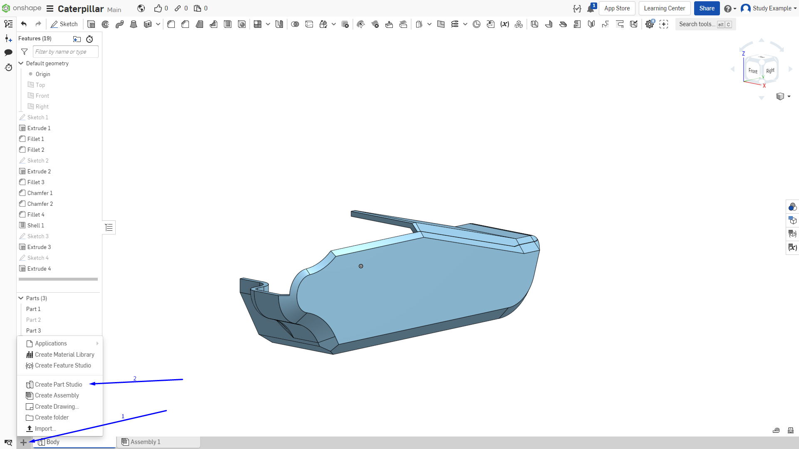

Лабораторная работа №2
=========================

Теперь создадим модель двигателя, под который и делается наша сборка.

Следует сделать его в новой “Parat studio”. Создадим новую вкладку с деталями.
1. Нажимаем на “+”
2. Выбираем “Create part studio”

       Рисунок 1 - Модель двигателя

Назовем ее “RealParts”.

Сейчас как раз произошло разделение деталей по группам, мы обособили
детали, касающиеся корпуса от деталей которые не будут участвовать в печати
(подшипники, двигатели и пр.)

Перед началом моделирования того, что уже существует, необходимо либо
иметь его чертежи с размерами, или этот объект и штангенциркуль для измерения.

Создаем первый эскиз.

       Рисунок 2 - Первый эскиз

Необходимо сделать срезы по всем углам, но, чтобы не проводить каждый раз
линию и не выставлять размеры можно воспользоваться операцией “Mirror”.

Для начала построим линии относительно которых будет производиться
отражение.

Проводим на произвольную длину.

       Рисунок 3

Далее используем модификатор превращающий их во вспомогательные или
осевые (Это делать не обязательно, но когда на эскизе очень много геометрии, то
разделение линий на основные и вспомогательные значительно упрощает восприятие)

1;2. Выделяем отрезки, которые хотим преобразовать; 

3. Активируем инструмент для преобразования.

.. figure:: _static/Pictures/lab2/Рисунок4.png
       :scale: 35 %
       :align: center
       :alt: Первый эскиз

       Рисунок 4

Теперь отражаем нашу геометрию.

1. Активируем инструмент для создания зеркальной геометрии.

2. Выбираем опорную прямую, относительно которой будет отражаться
геометрия.

3. Выбираем саму геометрию для отражения.

       Рисунок 5

Мы отразили уголок относительно вертикали, теперь аналогично отразим его
относительно горизонтали, чтобы получилось так:

       Рисунок 6

И выдавливаем на 9.5 мм.

       Рисунок 7

Создаем новый эскиз на выделенной плоскости.

.. figure:: _static/Pictures/lab2/Рисунок8.png
       :scale: 35 %
       :align: center
       :alt: Первый эскиз

       Рисунок 8

Создаем эскиз. (Сначала был спроектирован контур выделенной детали, потом с
помощью Offset былми сдвинты необходимые линии на 2 мм и позже удлинены до границ,
чтобы замкнуть эскиз, но можно делать и другими способами).

.. figure:: _static/Pictures/lab2/Рисунок9.png
       :scale: 35 %
       :align: center
       :alt: Первый эскиз

       Рисунок 9

Далее выдавливаем его на 23мм.

.. figure:: _static/Pictures/lab2/Рисунок10.png
       :scale: 35 %
       :align: center
       :alt: Первый эскиз

       Рисунок 10

Создаем эскиз

       Рисунок 11

       Рисунок 12

Выдавливаем на 8 мм.

       Рисунок 13

Далее создаем эскизы и выдавливания соответственно. Создаем верхнее кольцо
шаговика.

       Рисунок 14 - Верхнее кольцо шаговика

       Рисунок 15

Создадим вал двигателя. Окружность в центре предварительно выдавлена.

       Рисунок 16

       Рисунок 17

Теперь необходимо сделать несколько отверстий для крепления двигателя (у
NEMA 17 это 4 отверстия под винты М3).

       Рисунок 18

Используя вспомогательную геометрию (квадрат 31 на 31 с центром в центре
окружности) строим 4 окружности радиусом 3 мм.

       Рисунок 19

И выдавливаем их вниз на 7мм.

       Рисунок 20

Теперь сделаем входной порт для проводов. Создаем эскиз снизу нашей модели.

       Рисунок 21

Для простоты был использован прямоугольник с центром в заданной точке,
чтобы удалить лишнюю геометрию используем инструмент “Trim”. Но предварительно
спроецируем геометрию нашей плоскости.

       Рисунок 22

1. Активируем инструмент;
2. Выбираем геометрию для удаления.

Отличие этого метода от простого выделения геометрии с последующим
удалением клавишей “Delete” в том, что этот инструмент позволяет удалять геометрию
от точки до точки.

.. figure:: _static/Pictures/lab2/Рисунок23.png
       :scale: 35 %
       :align: center
       :alt: Первый эскиз

       Рисунок 23

.. figure:: _static/Pictures/lab2/Рисунок24.png
       :scale: 35 %
       :align: center
       :alt: Первый эскиз

       Рисунок 24

Выдавливаем на 9.5 мм.

.. figure:: _static/Pictures/lab2/Рисунок25.png
       :scale: 35 %
       :align: center
       :alt: Первый эскиз

       Рисунок 25

На верхней части двигателя возле вала есть выемка, в которую могут упираться
некоторые детали. Создаем эскиз.

.. figure:: _static/Pictures/lab2/Рисунок26.png
       :scale: 35 %
       :align: center
       :alt: Первый эскиз

       Рисунок 26

       Рисунок 27

Выдавливаем вглубь на 3мм.

       Рисунок 28

Вернемся к валу двигателя. Сделаем фаску.

.. figure:: _static/Pictures/lab2/Рисунок29.png
       :scale: 35 %
       :align: center
       :alt: Первый эскиз

       Рисунок 29

Чтобы на валу было проще закреплять детали (шестерни муфты и т.д.)
производители делают небольшую площадку (лыску) для предотвращения
прокручивания детали.

Создаем скетч на верхней плоскости вала.

       Рисунок 30

Выдавливаем на 21мм.

       Рисунок 31

Двигатель готов.

Для более детализированной сборки с демонстрацией работы абсолютно всех
узлов двигатель следовало бы изготовить из 2 деталей: корпуса и вала. 
Но в наших условиях нет такой необходимости, поэтому модель немного упрощена.