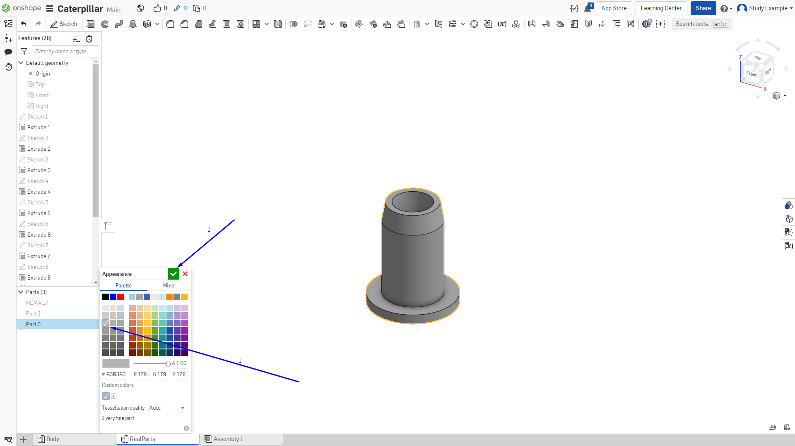

Лабораторная работа №3
=========================

1. Создание подшипника

В той же “RealParts”. Создаем новый эскиз на правой плоскости на некотором
удалении от двигателя, чтобы детали не перекрывали друг друга.

.. figure:: _static/Pictures/lab3/Рисунок1.png
       :scale: 35 %
       :align: center
       :alt: Лаб3

       Рисунок 1 

.. figure:: _static/Pictures/lab3/Рисунок2.png
       :scale: 35 %
       :align: center
       :alt: Лаб3

       Рисунок 2 

И теперь выдавливаем наш эскиз вращением.

1. Выбираем инструмент
2. Выделяем эскиз.

.. figure:: _static/Pictures/lab3/Рисунок3.png
       :scale: 35 %
       :align: center
       :alt: Лаб3

       Рисунок 3 

Теперь необходимо выбрать ось вращения.

1. Активируем пункт выбора оси вращения;
2. Выделяем ось вращения.

.. figure:: _static/Pictures/lab3/Рисунок4.png
       :scale: 35 %
       :align: center
       :alt: Лаб3

       Рисунок 4 

       Рисунок 5 

На полученной 3д модели делаем фаску. На внешней и внутренней окружности с двух сторон.

       Рисунок 6 

Получилось 2 детали.

       Рисунок 7 

Теперь переименуем их.

1. Нажимаем ПКМ по детали в списке деталей.
2. Меняем имя и подтверждаем изменение клавишей Enter.

       Рисунок 8 

И задаем деталям соответствующие имена, как показано на картинке.

       Рисунок 9 

2. Создание втулки под М4

(в сборке будет плотно вставляться в корпус и держать на себе рычаги подвески)
Аналогично подшипнику создаем эскиз на правой плоскости.

       Рисунок 10 

И так же выдавливаем его вращением вокруг выделенной оси.

       Рисунок 11 

       Рисунок 12 

Давайте поменяем цвет нашей детали.

1. Нажимаем ПКМ по детали в списке деталей;
2. Выбираем пункт “Edit appearance”.

.. figure:: _static/Pictures/lab3/Рисунок13.png
       :scale: 35 %
       :align: center
       :alt: Лаб3

       Рисунок 13 

1. Выбираем нужный цвет;
2. Подтверждаем изменения.

       Рисунок 14 

Также меняем имя детали на “Bushing”.

.. figure:: _static/Pictures/lab3/Рисунок15.png
       :scale: 35 %
       :align: center
       :alt: Лаб3

       Рисунок 15 

Кстати, можно менять цвет не только целой модели, но и отдельных частей. Для этого с зажатым шифтом выделяем необходимые для замены цвета плоскости.

.. figure:: _static/Pictures/lab3/Рисунок16.png
       :scale: 35 %
       :align: center
       :alt: Лаб3

       Рисунок 16 

Далее нажимаем ПКМ рядом с моделью или на выделенной грани. И выбираем выделенный пункт.

       Рисунок 17 

Аналогичным образом задаем цвет.

       Рисунок 18 

И в итоге получаем довольно схожее с реальными деталями.

.. figure:: _static/Pictures/lab3/Рисунок19.png
       :scale: 35 %
       :align: center
       :alt: Лаб3

       Рисунок 19 

       Рисунок 20 
