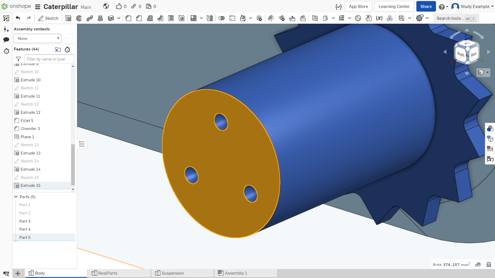

Лабораторная работа №7
=========================

Создание ведущего колеса

При разработке гусеничного движителя расчет траков (трак — это составная часть гусеницы) и ведущего колеса - зависимые процессы, и, зачастую, ведущее колесо рассчитывается под уже готовый трак. В данной работе мы не будем производить расчеты, а построим модели по уже рассчитанным эскизам. Однако, если вам будет интересно или в будущем возникнет потребность расчета, то более подобный процесс описан в книге.

Первым делом создадим плоскость на расстоянии 2 мм от стенки корпуса. Выбираем инструмент «плоскость». Выбираем плоскость, на основе которой будет создана новая плоскость. Задаем расстояние – 2 мм. Иллюстрация на рисунке 1.

       Рисунок 1 - Создание плоскости на расстоянии 2 мм

Для удобства муфта была скрыта из видимости. Создаем вспомогательную геометрию-окружность с центром в центральной точке отверстия (воспользуйтесь проецированием) и вертикальный отрезок, соединяющий окружность с ее центром, как показано на рисунке 2.

       Рисунок 2 - Создание вспомогательной окружности

Далее создадим отрезок, перпендикулярный радиусу, длиной 5 мм. В точке пересечения отрезка и окружности создадим новую окружность, как показано на рисунке 3.

       Рисунок 3 - Создание отрезка 5 мм

Далее продлим отрезок от точки пересечения радиуса и перпендикулярного ему отрезка на 2.77 мм, как показано на рисунке 4. Соединим конец этого отрезка с касательной к малой окружности, как показано на рисунке 4.

.. figure:: _static/Pictures/lab7/Рисунок4.png
       :scale: 35 %
       :align: center
       :alt: Построение отрезка

       Рисунок 4 - Построение отрезка

Отразим построенную фигуру относительно радиуса, как показано на рисунке 5.

.. figure:: _static/Pictures/lab7/Рисунок5.png
       :scale: 35 %
       :align: center
       :alt: Отражение фигуры

       Рисунок 5 - Отражение фигуры

Далее необходимо размножить данную фигуру по всему радиусу. Для этого создаем круговой массив с центром в центральной точке большой окружности, как показано на рисунке 6. Задаем количество элементов – 14, как показано на рисунке 7.

       Рисунок 6 - Создание кругового массива

.. figure:: _static/Pictures/lab7/Рисунок7.png
       :scale: 35 %
       :align: center
       :alt: Создание кругового массива

       Рисунок 7 - Создание кругового массива

Далее необходимо в центре большой окружности создать новую окружность диаметром 22.6 мм, как показано на рисунке 8.

       Рисунок 8 - Создание окружности

Выдавливаем получившуюся фигуру на 3.7 мм, как показано на рисунке 9 – 10.

       Рисунок 9 - Выдавливание фигуры

       Рисунок 10 - Выдавливание фигуры

Создаем новый эскиз в центре все той же окружности диаметром 27.6 мм, как показано на рисунке 11.

       Рисунок 11 - Создание окружности

Далее выдавливаем фигуру на 22.4 мм, как показано на рисунке 12.

       Рисунок 12 - Выдавливание фигуры

Создаем новый эскиз на выделенной плоскости. Нам необходимо перенести отверстия с муфты на этот эскиз. Для этого была восстановлена видимость муфты и, с помощью инструмента проекции, спроецированы все 3 отверстия. Далее будет виден выдавливаемый эскиз. Иллюстрация на рисунке 13-14.

       Рисунок 13 - Создание эскиза

       Рисунок 14 - Создание эскиза

Далее выдавливаем фигуру на 20.4мм, как показано на рисунке 15.

       Рисунок 15 - Выдавливание фигуры

Далее нам необходимо будет построить еще один эскиз, используя проекцию, как показано на рисунке 16.

       Рисунок 16 - Создание эскиза проекцией

Выдавливаем эскиз на 3.7мм, как показано на рисунке 17.

       Рисунок 17 - Выдавливание эскиза

Создаем новый эскиз в виде окружностью с центром в цилиндре, показанном на рисунке 18.

       Рисунок 18 - Создание эскиза

Создаем выемку для того, чтобы элементы крепления колеса не выходили за габариты колеса, как показано на рисунке 19.

.. figure:: _static/Pictures/lab7/Рисунок19.png
       :scale: 35 %
       :align: center
       :alt: Создание выемки

       Рисунок 19 - Создание выемки

Далее необходимо добавить фаски:

1) Величиной 8мм;
2) Величиной 5мм.

Иллюстрация показана на рисунке 20.

       Рисунок 20 - Создание фасок
