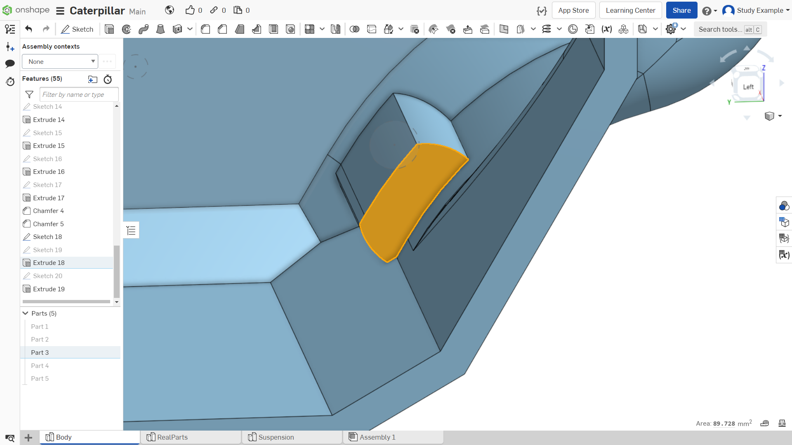

Лабораторная работа №8
=========================

Отверстия для крепления подвески

Теперь вернемся к разработанному ранее корпусу. 

Далее необходимо создать отверстия для крепления элементов подвески. Для начала необходимо создать эскиз на плоскости корпуса, как показано на рисунке 1. 

Обязательно повторите размеры в точности как на рисунке. 

Обратите внимание, что все размеры строятся от центра отверстия.

       Рисунок 1 - Создание эскиза

       Рисунок 2 - Создание эскиза

Такие нецелые числа обусловлены точной подгонкой подвески и ведущего колеса, чтобы подпорные катки находились как можно ближе к задней части, но при этом при работе не задевали ведущее колесо.

С помощью линейного массива создадим 2 копии всех отверстий на расстоянии 70 мм, как показано на рисунке 3–4.

       Рисунок 3 - Создание линейного массива

       Рисунок 4 - Создание линейного массива

Не спешите выдавливать данный эскиз, сделаем это чуть позже. Можно заметить, что одна окружность не лежит на плоскости (рисунок 5), так как это отверстие для элемента, который будет держать передний рычаг подвески, необходимо сделать утолщение в корпусе для крепления.

.. figure:: _static/Pictures/lab8/Рисунок5.png
       :scale: 35 %
       :align: center
       :alt: Окружность не в плоскости

       Рисунок 5 - Окружность не в плоскости

Создаем новый эскиз в той же плоскости. Создаем окружность с помощью операции «Offset» со смещением 5 мм, как показано на рисунке 6.

       Рисунок 6 - Создание окружности с помощью операции «Offset»

Выдавливаем во внутрь корпуса на 30 мм. Обратите внимание на модификатор выдавливания, необходимо чтобы был выбран «Add», как показано на рисунке 7.

       Рисунок 7 - Выдавливание эскиза

Создадим эскиз на внутренней части стенки корпуса. Две окружности диаметром 12 мм, центры которых лежат на центрах окружностей эскиза с другой стороны (используем проецирование). Иллюстрация показана на рисунке 8.

       Рисунок 8 - Создание эскиза

Выдавим созданный эскиз на 6 мм, как это показано на рисунке 9.

       Рисунок 9 - Выдавливание эскиза

Создаем эскиз на плоскости, показанной на рисунке 10.

       Рисунок 10 - Создание эскиза

Проецируем центр окружности эскиза, также проецируем отрезки внутренних стенок корпуса, как показано на рисунке 11, строим окружность диаметром 13 мм.

.. figure:: _static/Pictures/lab8/Рисунок11.png
       :scale: 35 %
       :align: center
       :alt: Создание эскиза

       Рисунок 11 - Создание эскиза

Выдавливаем созданный эскиз на 20 мм, как показано на рисунке 12.

       Рисунок 12 - Выдавливание эскиза

Вернемся к эскизу, на котором мы ранее сделали множество окружностей (рисунок 5). Выдавливаем во внутрь все отверстия на 10 мм, как показано на рисунке 13.

.. figure:: _static/Pictures/lab8/Рисунок13.png
       :scale: 35 %
       :align: center
       :alt: Выдавливание эскиза

       Рисунок 13 - Выдавливание эскиза

На выдавленных окружностях добавим фаски по 1 мм, как показано на рисунке 14.

       Рисунок 14 - Добавление фасок

Аналогично добавляем фаски с другой стороны, как показано на рисунках 15–16.

.. figure:: _static/Pictures/lab8/Рисунок15.png
       :scale: 35 %
       :align: center
       :alt: Добавление фасок

       Рисунок 15 - Добавление фасок

.. figure:: _static/Pictures/lab8/Рисунок16.png
       :scale: 35 %
       :align: center
       :alt: Добавление фасок

       Рисунок 16 - Добавление фасок

Перейдем к проработке креплений для сборки корпуса. Возвращаем видимость 2 детали. Создаем эскиз на плоскости, указанной на рисунке 17.

       Рисунок 17 - Плоскость для эскиза

Создаем эскизы отверстий, с помощью которых будут стягиваться верхняя и нижняя деталь. Диаметр отверстий 3.2 мм.

.. figure:: _static/Pictures/lab8/Рисунок18.png
       :scale: 35 %
       :align: center
       :alt: Эскизы отверстий

       Рисунок 18 - Эскизы отверстий

Выбираем все окружности для выдавливания с модификатором “Remove”. Т. к. детали разделены, программа не понимает к какой детали применять инструмент. Чтобы указать к каким деталям применить выдавливание, нажимаем на “Merge scope”, как показано на рисунке 19.

       Рисунок 19 - Выдавливание эскиза

Выбираем детали, к которым применим выдавливание, как показано на рисунке 20.

       Рисунок 20 - Выбор деталей

На каждое отверстие добавляем фаски на 1 мм.

       Рисунок 21 - Создание фасок

Создадим элементы крепления на боковой части верхней крышки, как показано на рисунке 22.

       Рисунок 22 - Создание нового элемента

Создаем эскиз на выделенной плоскости. Две окружности 10 мм на расстоянии 80 мм, как показано на рисунке 10. Иллюстрация эскиза на рисунке 23.

.. figure:: _static/Pictures/lab8/Рисунок23.png
       :scale: 35 %
       :align: center
       :alt: Создание эскиза

       Рисунок 23 - Создание эскиза

Выдавливаем 2 окружности на 8 мм.

.. figure:: _static/Pictures/lab8/Рисунок24.png
       :scale: 35 %
       :align: center
       :alt: Выдавливание эскиза

       Рисунок 24 - Выдавливание эскиза

Далее создадим фаски, как показано на рисунках 25–26. В данном случае они используются, как элемент жесткости.

       Рисунок 25 - Создание фасок

       Рисунок 26 - Создание фасок
