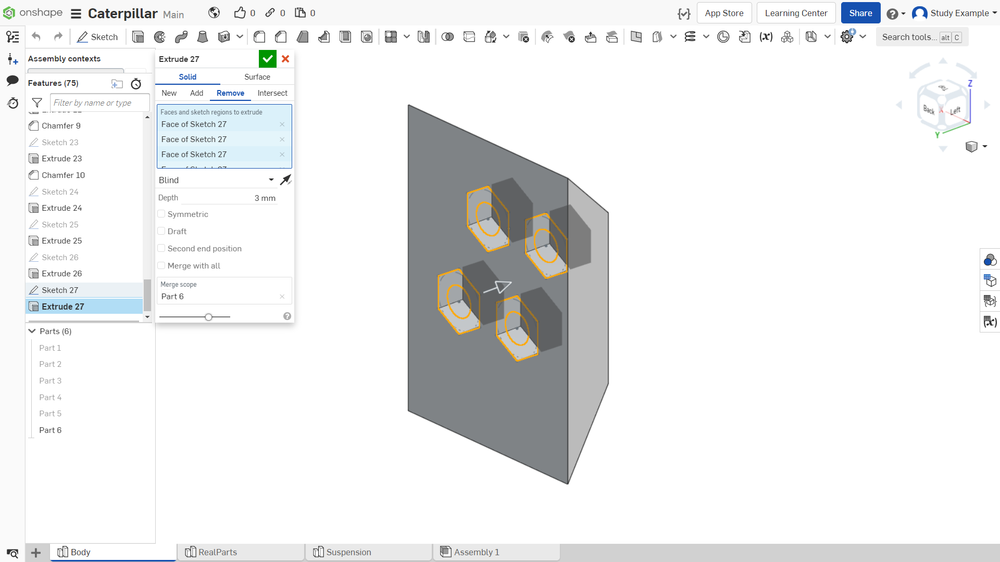

Лабораторная работа №9
=========================

Создание элемента крепления двух частей модели

Продолжаем работать с моделью, полученной в лабораторной работе 8. 

Создаем эскиз двух шестиугольников со вписанной окружностью, с центром в центральной точке ранее выдавленных окружностей. Иллюстрация на рисунке 1.

       Рисунок 1 - Создание эскиза

Выдавливаем эскиз на 3 мм, как это показано на рисунке 2. Далее в эти места будут вставляться гайки M3 для крепления.

       Рисунок 2 - Выдавливание эскиза

Переходим к лицевой стороне детали, как показано на рисунке 3.

       Рисунок 3 - Плоскость для создания эскиза

Создаем эскиз для отверстий, в которых будут проходить винты M3 и вкручиваться в гайку, под которую мы ранее с вами создали посадочные места. Иллюстрация на рисунке 4.

       Рисунок 4 - Создание эскиза

Далее выдавливаем эскиз для получения сквозных отверстий, как показано на рисунке 5.

       Рисунок 5 - Выдавливание эскиза

Перейдем к детали, скрепляющей переднюю часть корпуса. Выбираем плоскость, на которой будем создавать эскиз, как показано на рисунке 6.

       Рисунок 6 - Выбор плоскости для эскиза

Создаем эскиз прямоугольника, имеющий общие точки с проекцией корпуса в указанных местах и толщиной 5мм, как показано на рисунке 7.

       Рисунок 7 - Создание эскиза

Достраиваем два треугольника с помощью отрезков снизу и сверху, как показано на рисунке 8.

       Рисунок 8 - Создание эскиза

Выдавливаем на 22 мм, модификатор выдавливания «New», как показано на рисунке 9.

       Рисунок 9 - Выдавливание эскиза

Создаем эскиз на плоскости, нам необходимо спроецировать на него отверстия в передней части корпуса, которые мы сделали раньше. Иллюстрация на рисунке 10.

       Рисунок 10 - Плоскость для эскиза

Поворачиваем камеру и выделяем окружности отверстий с помощью инструмента проекций, как показано на рисунке 11.

       Рисунок 11 - Выделение отверстий

Возвращаемся в плоскость эскиза, и, с помощью спроецированных окружностей, строим 4 шестиугольника. Для того, чтобы разместить их таким же образом как на картинке, использовалась вертикальная привязка одной из сторон шестиугольников (активировать создание такой привязки на клавишу “V”). Иллюстрация на рисунке 12.

.. figure:: _static/Pictures/lab9/Рисунок12.png
       :scale: 35 %
       :align: center
       :alt: Создание эскиза

       Рисунок 12 - Создание эскиза

Выдавливаем шестиугольники на глубину 3мм, как показано на рисунке 13.

       Рисунок 13 - Выдавливание эскиза

Для того, чтобы сделать сквозные круглые отверстия, сделаем видимым предыдущий эскиз, как показано на рисунке 14.

.. figure:: _static/Pictures/lab9/Рисунок14.png
       :scale: 35 %
       :align: center
       :alt: Создание эскиза

       Рисунок 14 - Создание эскиза

Теперь выдавим только окружности на глубину 5 мм для получения сквозных отверстий, как показано на рисунке 15.

       Рисунок 15 - Выдавливание окружности

Т.к дальше деталь не будет редактироваться, то завершим ее создание с помощью инструмента “Mirror”. Активируем инструмент. Выбираем деталь для отражения. Активируем выбор плоскости симметрии. Нажимаем на плоскость для “отзеркаливания” детали. Иллюстрация на рисунке 16.

       Рисунок 16 - Инструмент "Mirror"

Соединительный элемент готов. Конечный вид можно увидеть на рисунке 17.

.. figure:: _static/Pictures/lab9/Рисунок17.png
       :scale: 35 %
       :align: center
       :alt: Готовый элемент

       Рисунок 17 - Готовый элемент

Далее вернемся к корпусу, который показан на рисунке 18.

.. figure:: _static/Pictures/lab9/Рисунок18.png
       :scale: 35 %
       :align: center
       :alt: Модель корпуса

       Рисунок 18 - Модель корпуса

Аналогично проецируем ранее созданные окружности в верхней детали, как показано на рисунке 19.

       Рисунок 19 - Проецирование отверстий

Выдавливаем получившиеся эскизы насквозь, как показано на рисунке 20.

       Рисунок 20 - Выдавливание эскиза

Обратите внимание: верхняя часть окружности тоже должна быть выделена при выдавливании. Иллюстрация на рисунке 21.

       Рисунок 21 - Выделение окружности

Добавляем фаски 1 мм, как показано на рисунке 22.

.. figure:: _static/Pictures/lab9/Рисунок22.png
       :scale: 35 %
       :align: center
       :alt: Добавление фасок

       Рисунок 22 - Добавление фасок
